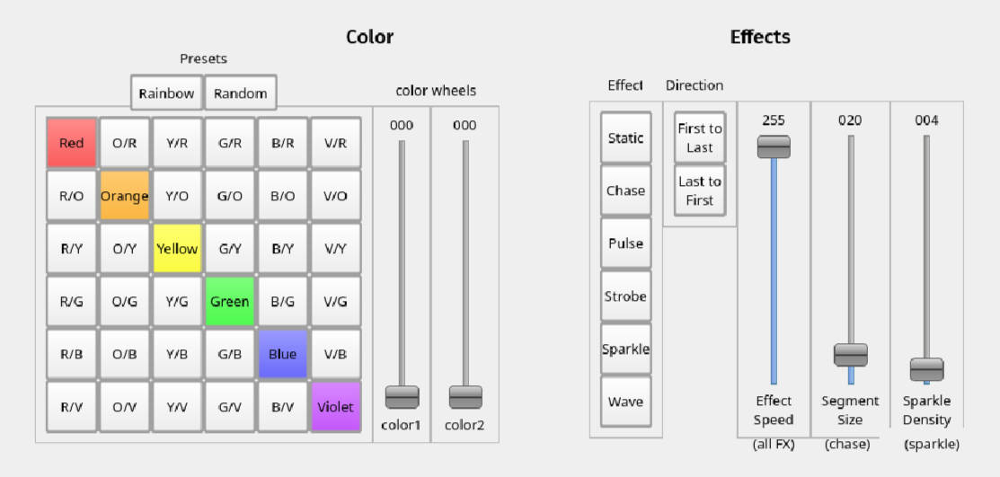

# dmx-neopixel
 Control your NeoPixel (or any ws281x based LEDs) using the DMX protocol 
---

# Hardware
to avoid conflicts between the dmx and neopixel signals, you'll need two separate arduinos. One must be an Uno, the other is up to you but I recommend a Nano.

You'll also need a DMX shield for the Uno. I used the one from CQRobot.

## QLC+
I've created a custom fixture and workspace file for Q Light Controller Plus (QLC+), a super awesome open-source DMX control program.
The files can be found under ./QLC.

The workspace file (dmx-neopixel.qxw) contains controls and presets to demonstrate what this project can do.
Load the workspace into QLC+, then switch to the Virtual Console tab at the bottom. Press the green triangle in the top right to switch out of design mode.
You should now see the following:

To display something on the strip, you need to choose a base color and then apply effect modifiers.
to select a color you can either use the button matrix or the color sliders.

the default effect is static, but there are more you can choose in the effects panel.

